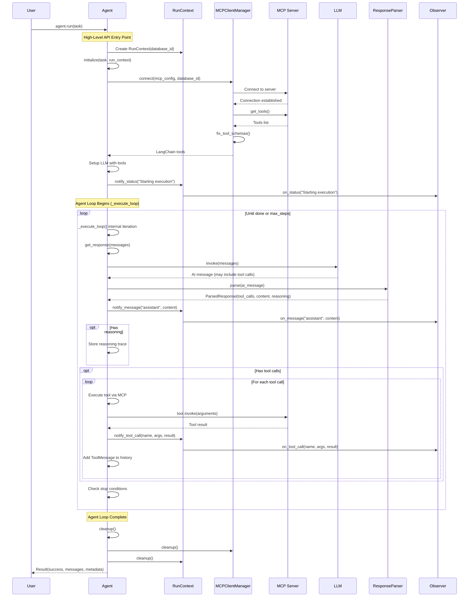
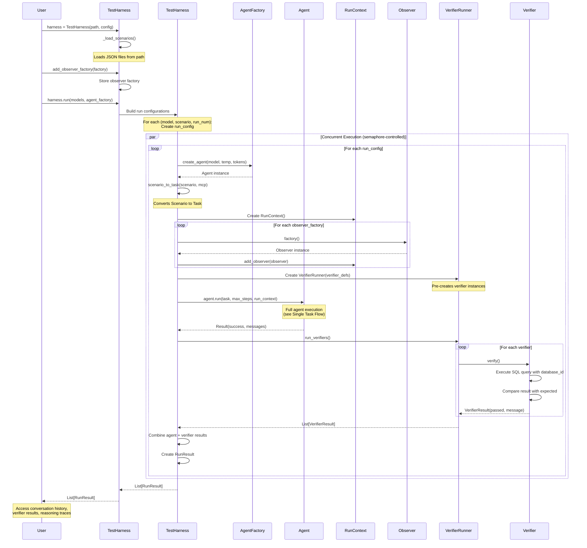
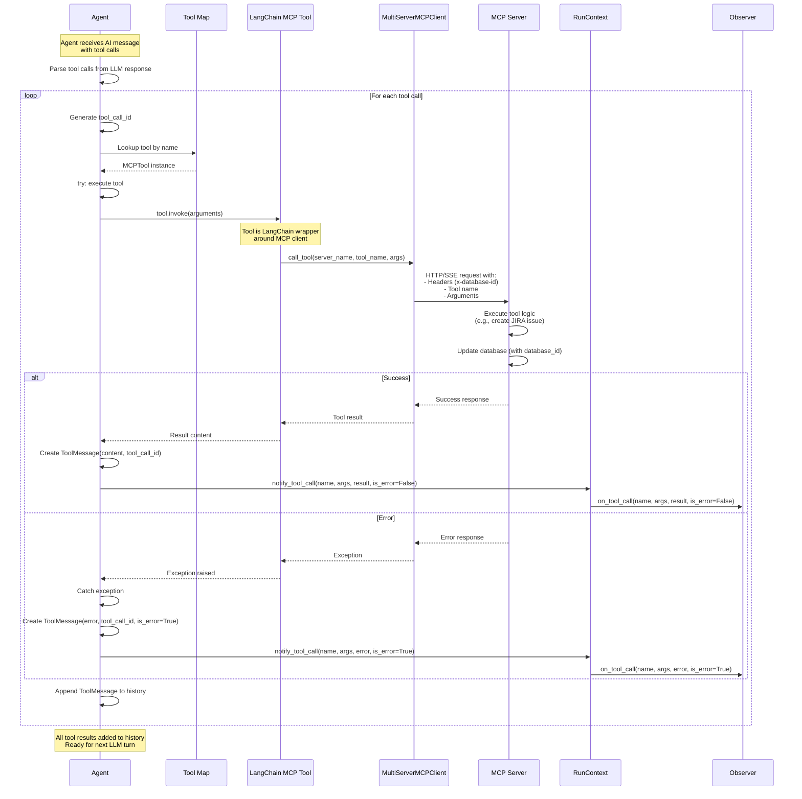
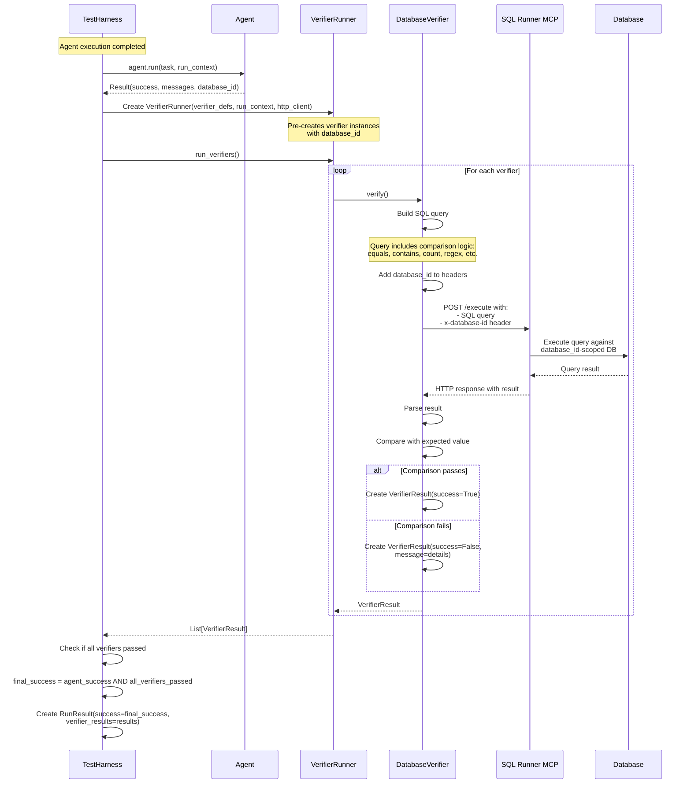

# MCP Benchmark SDK - Architecture Documentation

## Table of Contents

1. [Overview](#overview)
2. [Core Components](#core-components)
3. [Execution Flows](#execution-flows)
4. [Design Decisions](#design-decisions)
5. [Code Examples](#code-examples)

---

## Overview

The MCP Benchmark SDK is a Python framework for building and running LLM agent benchmarks against MCP (Model Context Protocol) servers. It provides a multi-level API that supports everything from complete automation to fine-grained control over agent execution.

### Key Features

- **Multi-Level API**: High-level automation, mid-level customization, low-level control
- **Provider Support**: OpenAI (GPT), Anthropic (Claude), Google (Gemini), xAI (Grok)
- **MCP Integration**: Connect to MCP servers for tool execution
- **Observable Execution**: Event system for logging, UI, and telemetry
- **Extensible Verification**: Built-in SQL verifiers with custom verifier support
- **Test Harness**: Systematic benchmarking across models and scenarios
- **LangSmith Integration**: Built-in tracing support for debugging

---

## Core Components

### Component Architecture

```
┌─────────────────────────────────────────────────────────────────┐
│                      HIGH-LEVEL API                              │
│  TestHarness, HarnessLoader, Agent Factories                    │
└─────────────────────────────────────────────────────────────────┘
                              │
┌─────────────────────────────────────────────────────────────────┐
│                   ORCHESTRATION LAYER                            │
│  TestHarness, VerifierRunner                                    │
└─────────────────────────────────────────────────────────────────┘
                              │
┌─────────────────────────────────────────────────────────────────┐
│                       AGENT LAYER                                │
│  Agent (Base) → ClaudeAgent, GPTAgent, GeminiAgent, GrokAgent  │
└─────────────────────────────────────────────────────────────────┘
                              │
┌─────────────────────────────────────────────────────────────────┐
│                      RUNTIME LAYER                               │
│  RunContext, RunObserver, Event System                          │
└─────────────────────────────────────────────────────────────────┘
                              │
┌─────────────────────────────────────────────────────────────────┐
│                        MCP LAYER                                 │
│  MCPClientManager, MCPConfig, Tool Loading                      │
└─────────────────────────────────────────────────────────────────┘
                              │
┌─────────────────────────────────────────────────────────────────┐
│                  TASK & RESULT LAYER                             │
│  Task, Result, AgentResponse, ToolCall, ToolResult             │
└─────────────────────────────────────────────────────────────────┘
                              │
┌─────────────────────────────────────────────────────────────────┐
│                    VERIFIER LAYER                                │
│  Verifier, DatabaseVerifier, VerifierResult                     │
└─────────────────────────────────────────────────────────────────┘
                              │
┌─────────────────────────────────────────────────────────────────┐
│                     PARSER LAYER                                 │
│  ResponseParser (Anthropic, OpenAI, Google, XAI)               │
└─────────────────────────────────────────────────────────────────┘
```

### Layer Responsibilities

#### 1. High-Level API Layer
- **Purpose**: Provides user-facing APIs for benchmark execution
- **Components**:
  - `TestHarness`: Entry point for running benchmarks
  - `HarnessLoader`: Loads benchmark definitions from JSON files
  - `Agent Factories`: Creates agent instances with optional tracing

#### 2. Orchestration Layer
- **Purpose**: Manages multi-model, multi-scenario benchmark execution
- **Components**:
  - `TestHarness`: Coordinates concurrent execution
  - `VerifierRunner`: Executes verifiers after agent completion

#### 3. Agent Layer
- **Purpose**: Core agent execution logic with multi-level API
- **Components**:
  - `Agent (Base)`: Abstract base with three API levels
  - Provider-specific agents: `ClaudeAgent`, `GPTAgent`, `GeminiAgent`, `GrokAgent`

#### 4. Runtime Layer
- **Purpose**: Execution context and observability
- **Components**:
  - `RunContext`: Centralizes database_id and observers
  - `RunObserver`: Event interface for monitoring execution

#### 5. MCP Layer
- **Purpose**: Manages connections to MCP servers
- **Components**:
  - `MCPClientManager`: Handles server connections and tool aggregation
  - `MCPConfig`: Server configuration (URL, transport, headers)

#### 6. Task & Result Layer
- **Purpose**: Data structures for input/output
- **Components**:
  - `Task`: Input specification (prompt, MCP config, metadata)
  - `Result`: Execution outcome with conversation history

#### 7. Verifier Layer
- **Purpose**: Post-execution validation
- **Components**:
  - `Verifier`: Abstract verification interface
  - `DatabaseVerifier`: SQL-based state verification

#### 8. Parser Layer
- **Purpose**: Provider-agnostic response parsing
- **Components**:
  - Provider-specific parsers for tool call extraction
  - Reasoning/thinking content extraction

---

## Execution Flows

### 1. Single Task Execution Flow

This is the most common flow when a user runs a single task with an agent.



#### Key Points:

1. **Initialization Phase**:
   - Creates `RunContext` with unique `database_id`
   - Connects to MCP server(s) and loads tools
   - Tools are automatically fixed for schema issues (reserved keywords)
   - LLM is configured with tools binding

2. **Execution Loop**:
   - Internal `_execute_loop()` iterates until completion or max_steps
   - Each iteration calls `get_response(messages)` which invokes the LLM
   - Response is parsed to extract tool calls, content, and reasoning
   - Tool calls are executed against MCP servers
   - All events are notified to observers for real-time monitoring

3. **Stop Conditions**:
   - LLM returns `stop_reason` indicating completion
   - Maximum steps reached
   - Tool call limit exceeded
   - Error occurred

4. **Cleanup**:
   - MCP connections are closed
   - Resources are released
   - Result with full conversation history is returned

---

### 2. Test Harness Execution Flow

This flow shows how the test harness orchestrates multiple benchmark runs across models and scenarios.



#### Key Points:

1. **Configuration Building**:
   - Harness creates a matrix of (model × scenario × run_number)
   - Each combination becomes a separate run configuration
   - Supports running each scenario multiple times (`runs_per_scenario`)

2. **Concurrency Control**:
   - Uses asyncio Semaphore to limit concurrent runs
   - Default: 20 concurrent runs (`max_concurrent_runs`)
   - Prevents overwhelming MCP servers or LLM APIs

3. **Observer Pattern**:
   - Each run gets fresh observer instances from factories
   - Observers are configured with run-specific labels
   - Enables per-run UI updates (progress bars, logs, etc.)

4. **Verifier Execution**:
   - Verifiers run **after** agent completes
   - Uses shared HTTP client for efficiency
   - Database ID ensures isolation between concurrent runs

5. **Result Aggregation**:
   - `RunResult` combines agent result + verifier results
   - Success = agent success AND all verifiers passed
   - Includes full conversation history, reasoning traces, metadata

---

### 3. MCP Tool Execution Flow

This diagram shows how tool calls are executed through the MCP layer.



#### Key Points:

1. **Tool Lookup**:
   - Tools are indexed by name in `tool_map` during initialization
   - Each tool is a LangChain wrapper around MCP client

2. **Database Isolation**:
   - `database_id` is injected as `x-database-id` header
   - Ensures each concurrent run has isolated state
   - MCP server uses this to scope database operations

3. **Error Handling**:
   - Tool errors are caught and converted to error ToolMessages
   - Agent continues execution with error message
   - LLM can see the error and retry or adjust strategy

4. **Observable Execution**:
   - All tool calls notify observers
   - Enables real-time UI updates
   - Useful for debugging and monitoring

---

### 4. Verification Flow

This shows how verifiers validate agent execution results.



#### Key Points:

1. **Verification Types**:
   - **equals**: Exact match with expected value
   - **contains**: Result contains expected substring
   - **count**: Row count matches expected
   - **regex**: Result matches regular expression
   - **greater_than** / **less_than**: Numeric comparisons

2. **Database Isolation**:
   - Each verifier uses the same `database_id` as the agent
   - Ensures verification checks the correct isolated state
   - Critical for concurrent benchmark execution

3. **SQL Runner MCP**:
   - Verifiers communicate with SQL Runner MCP service
   - Service executes queries against test databases
   - Returns structured results for comparison

4. **Pre-creation Pattern**:
   - Verifiers are created once and reused
   - Uses shared HTTP client for efficiency
   - Reduces overhead in concurrent execution

5. **Success Criteria**:
   - Final success = Agent succeeded AND All verifiers passed
   - Enables comprehensive validation beyond LLM completion
   - Can catch cases where agent thinks it succeeded but state is wrong

---

## Design Decisions

### 1. Multi-Level Agent API

**Decision**: Provide three API levels (high, mid, low) in a single `Agent` class.

**Rationale**:
- **High-level** (`agent.run(task)`): Simple one-liner for common cases
- **Mid-level** (Override `get_response()`, `get_response_parser()`): Custom LLM integration
- **Low-level** (Use primitives `initialize()`, `call_tools()`, etc.): Build custom workflows

**Benefits**:
- Single agent class for all use cases
- Progressive disclosure - start simple, customize as needed
- No separate "simple" vs "advanced" classes

**Code Example**:

```python
# High-level: Complete automation
agent = ClaudeAgent()
result = await agent.run(task)

# Mid-level: Custom LLM integration
class CustomAgent(Agent):
    async def get_response(self, messages):
        # Override to use custom LLM
        response = await my_custom_llm(messages)
        # Parse and return AgentResponse
        return parsed_response, raw_message
    
    def get_response_parser(self):
        return MyCustomParser()

# Use custom agent with high-level API
agent = CustomAgent()
result = await agent.run(task)  # Uses your custom LLM

# Low-level: Use primitives for custom workflow
agent = ClaudeAgent()
run_context = RunContext()
await agent.initialize(task, run_context)

# Build your own loop using primitives
messages = agent.get_initial_messages()
tools = agent.get_available_tools()
# ... custom execution logic ...

await agent.cleanup()
```

---

### 2. RunContext as Central Coordinator

**Decision**: Use `RunContext` to centralize database_id and observers.

**Rationale**:
- **Single source of truth** for execution context
- **Database isolation** via unique ID per run
- **Observable execution** via attached observers
- **Async context manager** support for cleanup

**Benefits**:
- Eliminates parameter passing throughout stack
- Easy to add new context data without changing signatures
- Natural place for telemetry and logging hooks

**Code Example**:

```python
# Automatic cleanup with context manager
async with RunContext() as ctx:
    ctx.add_observer(MyObserver())
    result = await agent.run(task, run_context=ctx)
# Cleanup happens automatically

# Or manual management
ctx = RunContext(database_id="test-123")
ctx.add_observer(MyObserver())
result = await agent.run(task, run_context=ctx)
await ctx.cleanup()
```

---

### 3. Observer Pattern for Extensibility

**Decision**: Use observer pattern for monitoring execution.

**Rationale**:
- **Decoupled monitoring**: Agents don't know about observers
- **Multiple observers**: Attach console, UI, telemetry simultaneously
- **Per-run instances**: Each run gets fresh observers

**Benefits**:
- Easy to add new observers without changing agent code
- Supports different UI modes (console, TUI, quiet)
- Enables comprehensive telemetry and debugging

**Observer Interface**:

```python
class RunObserver(ABC):
    @abstractmethod
    async def on_message(self, role: str, content: str, metadata: Optional[dict] = None):
        """Called when a message is added."""
        
    @abstractmethod
    async def on_tool_call(self, tool_name: str, arguments: dict, result: Any, is_error: bool = False):
        """Called when a tool is executed."""
        
    @abstractmethod
    async def on_status(self, message: str, level: str = "info"):
        """Called for status updates."""
```

**Example Implementations**:

```python
# Console observer for CLI
class ConsoleObserver(RunObserver):
    async def on_tool_call(self, tool_name, arguments, result, is_error):
        status = "✗" if is_error else "✓"
        print(f"[Tool] {tool_name} {status}")

# TUI observer for rich interface
class TextualObserver(RunObserver):
    async def on_message(self, role, content, metadata):
        await self.app.update_conversation(role, content)
    
    async def on_status(self, message, level):
        await self.app.update_status_bar(message)
```

---

### 4. Verifiers Separate from Agents

**Decision**: Verifiers run after agent execution, not during.

**Rationale**:
- **Clean separation**: Agents focus on task execution
- **Reusable verifiers**: Same verifier can validate multiple agents
- **Flexible verification**: Can run different verifiers for same execution

**Benefits**:
- Agent code stays simple and focused
- Easy to add new verification types
- Verifiers can be tested independently

**Verification Architecture**:

```python
# Define verifier in harness JSON
{
  "verifier": {
    "verifier_type": "database_state",
    "name": "issue_created",
    "validation_config": {
      "query": "SELECT COUNT(*) FROM issues WHERE title = ?",
      "expected_value": 1,
      "comparison_type": "equals"
    }
  }
}

# Execution flow
result = await agent.run(task)
verifier_results = await verifier_runner.run_verifiers()
final_success = result.success and all(v.success for v in verifier_results)
```

---

### 5. Database ID for Isolation

**Decision**: Use unique `database_id` per run for state isolation.

**Rationale**:
- **Concurrent execution**: Multiple runs don't interfere
- **Reproducible tests**: Each run starts with clean state
- **Traceable state**: Can inspect database for specific run

**Benefits**:
- Enables parallel benchmark execution
- Safe to run same scenario multiple times simultaneously
- Easier debugging - can examine database state for failed run

**Implementation**:

```python
# RunContext generates unique database_id
run_context = RunContext()  # database_id = uuid4()

# Injected into MCP headers
mcp_manager.connect(mcp_config, database_id=run_context.database_id)

# MCP server uses it to scope operations
@app.post("/mcp")
async def mcp_endpoint(request: Request):
    database_id = request.headers.get("x-database-id")
    # Use database_id to select/create isolated database
    db = get_database(database_id)
    # Execute operations against isolated DB
```

---

### 6. Provider-Agnostic with Provider-Specific Parsers

**Decision**: Unified `Agent` interface with provider-specific response parsing.

**Rationale**:
- **Consistent API**: Same code works with all providers
- **Provider optimization**: Each parser handles provider quirks
- **Easy to extend**: Add new providers by implementing parser

**Benefits**:
- Users write provider-agnostic code
- Can benchmark same task across multiple providers
- Provider differences are abstracted away

**Parser Responsibility**:

```python
class ResponseParser(ABC):
    @abstractmethod
    def parse(self, message: BaseMessage) -> ParsedResponse:
        """Parse provider-specific message format."""

# Anthropic: Handles thinking blocks
class AnthropicParser(ResponseParser):
    def parse(self, message):
        # Extract thinking blocks from content
        # Handle tool_use blocks
        
# OpenAI: Standard tool_calls format
class OpenAIParser(ResponseParser):
    def parse(self, message):
        # Extract from tool_calls attribute
        
# Google: Complex content structure
class GoogleParser(ResponseParser):
    def parse(self, message):
        # Parse nested content blocks
```

---

### 7. Retry Logic with Exponential Backoff

**Decision**: Built-in retry logic for transient failures.

**Rationale**:
- **API reliability**: LLM APIs have occasional failures
- **Rate limiting**: Backoff prevents overwhelming services
- **User experience**: Automatic recovery from transient issues

**Implementation**:

```python
@retry_with_backoff(
    max_attempts=DEFAULT_LLM_MAX_RETRIES,
    base_delay=RETRY_BASE_DELAY_SECONDS,
    max_delay=RETRY_MAX_DELAY_SECONDS,
    retry_on_status_codes=RETRY_TRANSIENT_STATUS_CODES,
)
async def get_response(self, messages, tools):
    return await self._llm.ainvoke(messages)

# Constants
DEFAULT_LLM_MAX_RETRIES = 3
RETRY_BASE_DELAY_SECONDS = 1.0
RETRY_MAX_DELAY_SECONDS = 60.0
RETRY_TRANSIENT_STATUS_CODES = {429, 500, 502, 503, 504}
```

---

### 8. Test Harness as Separate Layer

**Decision**: Test harness is built on top of core SDK, not integrated.

**Rationale**:
- **Modularity**: Core SDK can be used without harness
- **Use case flexibility**: Simple tasks don't need harness overhead
- **Clear boundaries**: Harness handles orchestration, SDK handles execution

**Benefits**:
- SDK is simpler and more focused
- Harness can be extended independently
- Users can build custom orchestration if needed

**Usage Patterns**:

```python
# Direct SDK usage (no harness)
agent = ClaudeAgent()
task = Task(prompt="Create issue", mcp=mcp_config)
result = await agent.run(task)

# Harness for benchmarking
harness = TestHarness(path="benchmarks/", config=config)
results = await harness.run(
    models=["gpt-4o", "claude-sonnet-4-5"],
    agent_factory=create_agent,
)
```

---

### 9. LangSmith and Langfuse Integration for Tracing

**Decision**: Optional tracing via LangSmith and/or Langfuse with a shared helper.

**Rationale**:
- **Debugging**: View full execution traces in the observability backend you prefer
- **Optional**: Works without either service (no hard dependency)
- **Non-invasive**: Wraps the agent and injects LangChain callbacks without changing business logic

**Implementation**:

```python
# LangSmith
configure_langsmith(project_name="bench", enabled=True)

# Langfuse
configure_langfuse(public_key="pk_...", secret_key="sk_...", base_url="https://cloud.langfuse.com")

# Automatic tracing with wrapper (enables both backends when configured)
agent = with_tracing(ClaudeAgent())
result = await agent.run(task)
print(result.langsmith_url)  # Optional
print(result.langfuse_url)   # Optional

# Or use create_traced_agent factory
agent = create_traced_agent("gpt-4o")
```

**TracingAgent Wrapper**:

```python
class TracingAgent(Agent):
    def __init__(self, agent: Agent):
        self._agent = agent
        
    async def run(self, task, max_steps, run_context):
        @traceable(name=f"agent_run_{self._agent.__class__.__name__}")
        async def traced_run():
            result = await self._agent.run(task, max_steps, run_context)
            result.langsmith_url = get_trace_url()
            result.langfuse_url = _get_langfuse_trace_url(self._agent)
            return result
        
        return await traced_run()
```

---

### 10. Async-First Design

**Decision**: All I/O operations are async from the ground up.

**Rationale**:
- **Concurrency**: Critical for benchmark harness
- **Performance**: Non-blocking I/O for LLM and MCP calls
- **Modern Python**: Aligns with async best practices

**Benefits**:
- Efficient parallel execution of benchmarks
- Non-blocking UI updates
- Scalable to hundreds of concurrent runs

**Example**:

```python
# All agent operations are async
async def run(self, task: Task) -> Result:
    await self.initialize(task, run_context)
    result = await self._execute_loop(max_steps, run_context)
    await self.cleanup()
    return result

# Tool calls are async
async def call_tools(self, tool_calls):
    results = []
    for tc in tool_calls:
        output = await tool.ainvoke(tc.arguments)
        results.append(output)
    return results

# Harness runs everything concurrently
async def run(self, models, agent_factory):
    tasks = [self._run_single(config) for config in run_configs]
    results = await asyncio.gather(*tasks)  # All run in parallel
```

---

## Code Examples

### Example 1: Simple Task Execution

```python
import asyncio
from mcp_benchmark_sdk import ClaudeAgent, Task, MCPConfig

async def main():
    # Create agent
    agent = ClaudeAgent(
        model="claude-sonnet-4-5",
        temperature=0.1,
    )
    
    # Define task    
    task = Task(
        prompt="Create a bug issue titled 'Test Bug' in project DEMO",
        mcp=MCPConfig(
            name="jira",
            url="http://localhost:8015/mcp",
            transport="streamable_http",
        ),
    )
    
    # Run task
    result = await agent.run(task)
    
    # Check result
    print(f"Success: {result.success}")
    print(f"Steps: {result.metadata.get('steps')}")
    print(f"Messages: {len(result.messages)}")
    
    # Access conversation
    for entry in result.get_conversation_history():
        if entry["type"] == "message":
            print(f"{entry['role']}: {entry['content'][:100]}")
        elif entry["type"] == "tool_call":
            print(f"🔧 {entry['tool']}")

asyncio.run(main())
```

---

### Example 2: Benchmark with Test Harness

```python
import asyncio
from pathlib import Path
from mcp_benchmark_sdk import (
    TestHarness,
    TestHarnessConfig,
    MCPConfig,
    create_agent,
)

async def main():
    # Configure MCP server
    mcp_config = MCPConfig(
        name="jira",
        url="http://localhost:8015/mcp",
        transport="streamable_http",
    )
    
    # Create harness
    harness = TestHarness(
        harness_path=Path("benchmarks/jira_tasks.json"),
        config=TestHarnessConfig(
            mcp=mcp_config,
            max_steps=1000,
            tool_call_limit=1000,
            runs_per_scenario=3,  # Run each scenario 3 times
            max_concurrent_runs=10,  # Max 10 parallel runs
        ),
    )
    
    # Run benchmarks across multiple models
    results = await harness.run(
        models=[
            "gpt-4o",
            "claude-sonnet-4-5",
            "gemini-2.5-pro",
            "grok-4",
        ],
        agent_factory=create_agent,
    )
    
    # Analyze results
    success_count = sum(1 for r in results if r.success)
    print(f"Success rate: {success_count}/{len(results)}")
    
    # Group by model
    by_model = {}
    for result in results:
        if result.model not in by_model:
            by_model[result.model] = []
        by_model[result.model].append(result)
    
    # Print summary
    for model, model_results in by_model.items():
        successes = sum(1 for r in model_results if r.success)
        print(f"{model}: {successes}/{len(model_results)}")

asyncio.run(main())
```

---

### Example 3: Custom Observer for Progress Tracking

```python
from mcp_benchmark_sdk import RunObserver

class ProgressObserver(RunObserver):
    def __init__(self):
        self.tool_calls = 0
        self.errors = 0
    
    async def on_message(self, role, content, metadata=None):
        print(f"[{role.upper()}] {content[:80]}...")
    
    async def on_tool_call(self, tool_name, arguments, result, is_error=False):
        self.tool_calls += 1
        if is_error:
            self.errors += 1
            print(f"❌ {tool_name}: {result}")
        else:
            print(f"✅ {tool_name}")
    
    async def on_status(self, message, level="info"):
        emoji = {"info": "ℹ️", "warning": "⚠️", "error": "❌"}.get(level, "ℹ️")
        print(f"{emoji} {message}")

# Use with agent
async def main():
    observer = ProgressObserver()
    
    async with RunContext() as ctx:
        ctx.add_observer(observer)
        result = await agent.run(task, run_context=ctx)
    
    print(f"Total tool calls: {observer.tool_calls}")
    print(f"Errors: {observer.errors}")
```

---

### Example 4: Custom Agent with Custom LLM (Simplified)

```python
from mcp_benchmark_sdk import Agent, AgentResponse, ToolCall
from langchain_core.messages import AIMessage

class MyCustomAgent(Agent):
    """Agent using custom LLM."""
    
    def __init__(self, model: str, api_key: str, **kwargs):
        super().__init__(**kwargs)
        self.model = model
        self.api_key = api_key
    
    async def get_response(self, messages):
        """Override to use custom LLM.
        
        Args:
            messages: List of conversation messages (LangChain format)
            
        Returns:
            Tuple of (AgentResponse, AIMessage)
        """
        # Call your custom LLM (tools are available as self._tools)
        response = await my_custom_llm_call(
            messages=messages,
            tools=self._tools,
            model=self.model,
            api_key=self.api_key,
        )
        
        # Parse tool calls
        tool_calls = []
        for tc in response.tool_calls:
            tool_calls.append(ToolCall(
                name=tc.name,
                arguments=tc.args,
                id=tc.id,
            ))
        
        # Create AgentResponse
        agent_response = AgentResponse(
            content=response.content,
            tool_calls=tool_calls,
            reasoning=response.thinking,
            done=response.is_complete,
        )
        
        # Create AIMessage for conversation history
        ai_message = AIMessage(
            content=response.content,
            tool_calls=[{"name": tc.name, "args": tc.arguments, "id": tc.id}
                       for tc in tool_calls],
        )
        
        return agent_response, ai_message
    
    def get_response_parser(self):
        """Return parser for this agent."""
        from mcp_benchmark_sdk.parsers import OpenAIParser
        return OpenAIParser()  # Or your custom parser

# Use custom agent with high-level API
agent = MyCustomAgent(model="my-model-v1", api_key="sk-...")
result = await agent.run(task)
print(f"Success: {result.success}")
```

---

### Example 5: Custom LLM Integration (Mid-Level API)

```python
from mcp_benchmark_sdk import Agent, ParsedResponse, ToolCall
from langchain_core.messages import AIMessage

class CustomLLMAgent(Agent):
    """Agent that integrates a custom LLM."""
    
    def __init__(self, model: str, api_key: str, **kwargs):
        super().__init__(**kwargs)
        self.model = model
        self.api_key = api_key
        self._custom_client = MyCustomLLMClient(api_key)
    
    async def get_response(self, messages):
        """Override to call custom LLM."""
        # Call your custom LLM API
        response = await self._custom_client.generate(
            messages=messages,
            model=self.model,
            tools=self._tools,
        )
        
        # Parse response into expected format
        tool_calls = []
        for tc in response.tool_calls:
            tool_calls.append(ToolCall(
                name=tc.name,
                arguments=tc.args,
                id=tc.id,
            ))
        
        # Create AgentResponse
        agent_response = AgentResponse(
            content=response.content,
            tool_calls=tool_calls,
            reasoning=response.thinking if hasattr(response, 'thinking') else None,
            done=response.is_complete,
        )
        
        # Create AIMessage for conversation history
        ai_message = AIMessage(
            content=response.content,
            tool_calls=[{"name": tc.name, "args": tc.arguments, "id": tc.id} 
                       for tc in tool_calls],
        )
        
        return agent_response, ai_message
    
    def get_response_parser(self):
        """Return custom parser if needed."""
        return MyCustomResponseParser()

# Use custom agent with high-level API
async def main():
    agent = CustomLLMAgent(
        model="my-model-v2",
        api_key="sk-...",
        system_prompt="You are a helpful assistant",
    )
    
    task = Task(prompt="Create issue", mcp=mcp_config)
    
    # High-level API works with custom LLM
    result = await agent.run(task)
    print(f"Success: {result.success}")
```

---

### Example 6: Custom Verifier

```python
from mcp_benchmark_sdk import Verifier, VerifierResult

class CustomAPIVerifier(Verifier):
    """Verifies state by calling external API."""
    
    def __init__(self, api_url: str, expected_status: str):
        self.api_url = api_url
        self.expected_status = expected_status
    
    async def verify(self) -> VerifierResult:
        import httpx
        
        async with httpx.AsyncClient() as client:
            response = await client.get(self.api_url)
            data = response.json()
            
            actual_status = data.get("status")
            success = actual_status == self.expected_status
            
            return VerifierResult(
                name="api_status_check",
                success=success,
                expected_value=self.expected_status,
                actual_value=actual_status,
                error=None if success else f"Expected {self.expected_status}, got {actual_status}",
            )

# Use custom verifier
verifier = CustomAPIVerifier(
    api_url="http://localhost:8000/api/status",
    expected_status="active",
)
result = await verifier.verify()
print(f"Verification: {result.success}")
```

---

### Example 7: Saving Benchmark Results

```python
import json
from pathlib import Path

async def run_and_save_benchmarks():
    harness = TestHarness(
        harness_path=Path("benchmarks/"),
        config=config,
    )
    
    results = await harness.run(
        models=["gpt-4o", "claude-sonnet-4-5"],
        agent_factory=create_agent,
    )
    
    # Save results to JSON
    output_dir = Path("results")
    output_dir.mkdir(exist_ok=True)
    
    for result in results:
        # Convert to dict
        result_dict = result.to_dict()
        
        # Save to file
        filename = f"{result.model}_{result.scenario_id}_r{result.run_number}.json"
        filepath = output_dir / filename
        
        with open(filepath, "w") as f:
            json.dump(result_dict, f, indent=2)
    
    # Save summary
    summary = {
        "total_runs": len(results),
        "successful": sum(1 for r in results if r.success),
        "failed": sum(1 for r in results if not r.success),
        "by_model": {},
    }
    
    for result in results:
        if result.model not in summary["by_model"]:
            summary["by_model"][result.model] = {"success": 0, "failed": 0}
        
        if result.success:
            summary["by_model"][result.model]["success"] += 1
        else:
            summary["by_model"][result.model]["failed"] += 1
    
    with open(output_dir / "summary.json", "w") as f:
        json.dump(summary, f, indent=2)
```

---

## Summary

The MCP Benchmark SDK provides a comprehensive framework for building and running LLM agent benchmarks. Its layered architecture supports multiple use cases:

- **Quick prototyping**: Use high-level API for simple tasks
- **Systematic benchmarking**: Use test harness for multi-model evaluation
- **Custom workflows**: Use mid/low-level APIs for fine control
- **Observable execution**: Use observers for monitoring and debugging
- **Extensibility**: Add custom agents, verifiers, and observers

The design prioritizes:
- **Modularity**: Clear separation of concerns
- **Flexibility**: Multiple API levels and extension points
- **Concurrency**: Efficient parallel execution
- **Observability**: Comprehensive event system
- **Provider agnosticism**: Consistent interface across LLM providers

This architecture enables robust, scalable benchmarking while remaining simple for common use cases.
