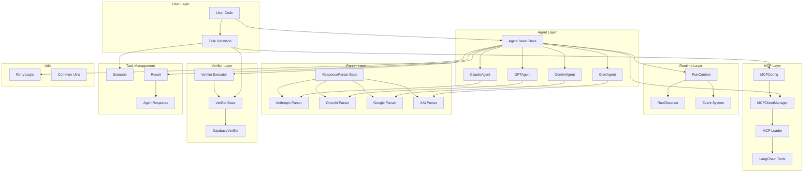
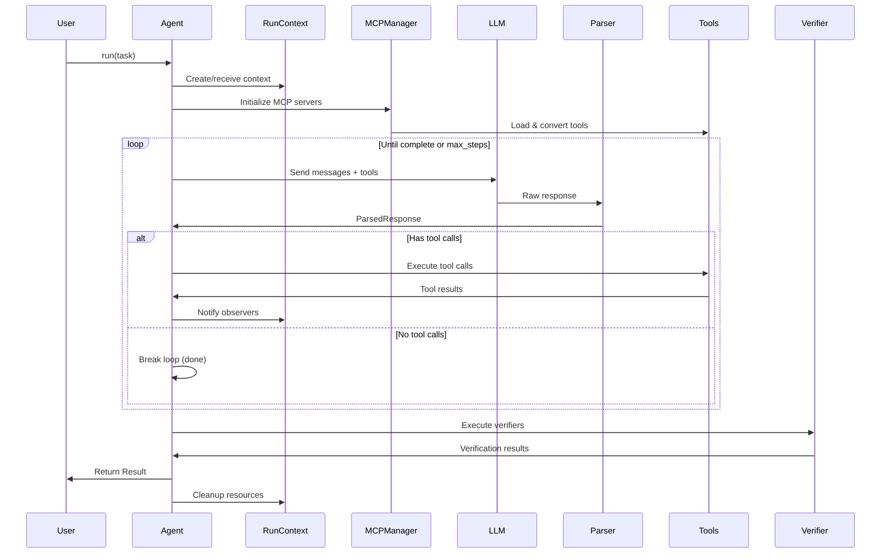

# MCP Benchmark SDK - Architecture

## Overview

The MCP Benchmark SDK is designed to benchmark LLM agents against MCP (Model Context Protocol) servers. It provides a flexible, multi-level API for running and evaluating agent tasks.

## High-Level Architecture



## Component Details

### 1. Agent Layer
**Location**: `agents/`

The core abstraction for LLM agents with a multi-level API:

- **Agent (Base)**: Abstract base class providing three levels of usage:
  - **High-level**: `agent.run(task)` - Complete automation
  - **Mid-level**: Override `get_response()`, `get_model_config()` - Custom LLM integration
  - **Low-level**: Manual loop control via primitives

- **Concrete Agents**:
  - `ClaudeAgent` - Anthropic Claude models
  - `GPTAgent` - OpenAI GPT models
  - `GeminiAgent` - Google Gemini models
  - `GrokAgent` - xAI Grok models

**Key Responsibilities**:
- Task execution orchestration
- LLM interaction
- Tool call management
- Message history tracking
- Result generation

### 2. Task Management
**Location**: `tasks/`

Defines the benchmark task structure:

- **Task**: User-facing task definition with:
  - `prompt`: The task instruction
  - `mcps`: List of MCP configurations
  - `verifiers`: List of verification checks
  - `max_steps`: Maximum agent turns
  - `metadata`: Additional context
  - `database_id`: Isolated database instance

- **Result**: Task execution outcome with:
  - Success/failure status
  - Final message history
  - Verifier results
  - Metadata

- **Scenario**: Advanced task with multiple prompts for conversation mode

- **AgentResponse**: Structured agent turn with messages and tool calls

### 3. Runtime Layer
**Location**: `runtime/`

Manages execution context and observability:

- **RunContext**: Centralized runtime state
  - Unique database ID per run
  - SQL runner URL for verifiers
  - Shared HTTP client
  - Event observers
  - Async context manager support

- **RunObserver**: Event observation interface
  - `on_message()` - Message events
  - `on_tool_call()` - Tool execution events
  - `on_verifier_update()` - Verification events
  - `on_status()` - Status updates

**Key Features**:
- Resource lifecycle management
- Event broadcasting
- Shared client pooling

### 4. MCP Layer
**Location**: `mcp/`

Handles Model Context Protocol integration:

- **MCPConfig**: MCP server configuration
  - Command and arguments
  - Environment variables
  - Server metadata

- **MCPClientManager**: MCP client lifecycle
  - Session management
  - Connection handling
  - Tool discovery

- **MCP Loader**: Converts MCP tools to LangChain tools
  - Tool schema conversion
  - Parameter validation
  - Error handling

**Integration Flow**:
1. Load MCP config
2. Start MCP server process
3. Establish client session
4. List available tools
5. Convert to LangChain format
6. Provide to agent

### 5. Parser Layer
**Location**: `parsers/`

Handles LLM response parsing across providers:

- **ResponseParser (Base)**: Abstract parser interface
  - `parse()` - Extract structured response
  - Provider-agnostic output format

- **Provider-Specific Parsers**:
  - `AnthropicParser` - Claude response format
  - `OpenAIParser` - GPT response format
  - `GoogleParser` - Gemini response format
  - `XAIParser` - Grok response format

**ParsedResponse Format**:
- Text content
- Tool calls with arguments
- Stop reason
- Usage metrics

### 6. Verifier Layer
**Location**: `verifiers/`

Validates task completion:

- **Verifier (Base)**: Abstract verifier interface
  - `verify()` - Returns pass/fail result
  - `description` - Human-readable check

- **DatabaseVerifier**: SQL-based verification
  - Executes queries against test database
  - Compares results to expected values
  - Supports complex assertions

- **Verifier Executor**: Batch execution utility
  - Runs multiple verifiers
  - Manages HTTP client lifecycle
  - Aggregates results

**VerificationContext**:
- SQL runner URL
- Database ID (isolation)
- HTTP client

### 7. Utils
**Location**: `utils/`

Shared utilities:

- **Retry Logic**: Exponential backoff with jitter
  - Configurable max attempts
  - Custom retry conditions
  - Provider-specific error handling

## Execution Flow



## Key Design Principles

### 1. **Multi-Level API**
- High-level: Simple `agent.run()` for common cases
- Mid-level: Override methods for customization
- Low-level: Full control over execution loop

### 2. **Provider Abstraction**
- Unified interface across LLM providers
- Provider-specific parsers handle differences
- Easy to add new providers

### 3. **Observable Execution**
- Event-driven observer pattern
- Non-intrusive logging/monitoring
- Real-time progress tracking

### 4. **Resource Management**
- Context managers for cleanup
- Ownership tracking
- HTTP client pooling

### 5. **Isolation**
- Database-per-run via unique IDs
- Independent verifier execution
- Clean state between runs

### 6. **Extensibility**
- Abstract base classes
- Plugin-style verifiers
- Custom tool support

## Usage Patterns

### Basic Usage (High-Level)
```python
from mcp_benchmark_sdk import Task, ClaudeAgent, MCPConfig, DatabaseVerifier

task = Task(
    prompt="Create a new Jira issue",
    mcps=[MCPConfig(command="jira-mcp", args=[])],
    verifiers=[DatabaseVerifier(query="SELECT COUNT(*) FROM issues", expected=1)]
)

agent = ClaudeAgent()
result = await agent.run(task)
print(result.success)
```

### With Observability (Mid-Level)
```python
from mcp_benchmark_sdk import RunContext, RunObserver

class MyObserver(RunObserver):
    async def on_message(self, role, content, metadata):
        print(f"{role}: {content}")
    
    async def on_tool_call(self, tool_name, arguments, result, is_error):
        print(f"Tool: {tool_name}({arguments}) -> {result}")

async with RunContext() as ctx:
    ctx.add_observer(MyObserver())
    result = await agent.run(task, run_context=ctx)
```

### Custom Agent (Low-Level)
```python
from mcp_benchmark_sdk import Agent

class CustomAgent(Agent):
    def get_model_config(self):
        return custom_llm, custom_parser
    
    async def get_response(self, messages, tools):
        # Custom LLM call logic
        return parsed_response

agent = CustomAgent()
result = await agent.run(task)
```

## File Structure

```
mcp_benchmark_sdk/
├── __init__.py           # Public API exports
├── agents/               # Agent implementations
│   ├── base.py          # Abstract Agent class
│   ├── claude.py        # Claude agent
│   ├── gpt.py           # GPT agent
│   ├── gemini.py        # Gemini agent
│   └── grok.py          # Grok agent
├── tasks/                # Task definitions
│   ├── task.py          # Task dataclass
│   ├── result.py        # Result types
│   └── scenario.py      # Multi-turn scenarios
├── runtime/              # Execution context
│   ├── context.py       # RunContext
│   └── events.py        # RunObserver
├── mcp/                  # MCP integration
│   ├── config.py        # MCPConfig
│   ├── loader.py        # Tool loading
│   └── tool_fixer.py    # Tool schema fixes
├── parsers/              # Response parsers
│   ├── base.py          # Parser interface
│   ├── anthropic.py     # Claude parser
│   ├── openai.py        # GPT parser
│   ├── google.py        # Gemini parser
│   └── xai.py           # Grok parser
├── verifiers/            # Verification system
│   ├── base.py          # Verifier interface
│   ├── database.py      # SQL verifiers
│   └── executor.py      # Batch execution
└── utils/                # Utilities
    └── retry.py         # Retry logic
```

## Extension Points

### Adding a New LLM Provider

1. Create agent class in `agents/`:
```python
class MyAgent(Agent):
    def get_model_config(self):
        model = MyLLM()
        parser = MyParser()
        return model, parser
```

2. Create parser in `parsers/`:
```python
class MyParser(ResponseParser):
    def parse(self, response) -> ParsedResponse:
        # Extract content, tool calls, etc.
        return ParsedResponse(...)
```

3. Export in `__init__.py`

### Adding a New Verifier Type

1. Create verifier in `verifiers/`:
```python
class MyVerifier(Verifier):
    async def verify(self, context: VerificationContext) -> VerifierResult:
        # Custom verification logic
        return VerifierResult(...)
```

2. Export in `__init__.py`

### Adding Custom Observers

1. Implement RunObserver interface:
```python
class MyObserver(RunObserver):
    async def on_message(self, role, content, metadata):
        # Custom logging/monitoring
        pass
```

2. Register with RunContext:
```python
ctx.add_observer(MyObserver())
```

## Dependencies

- **LangChain**: LLM abstraction and tool framework
- **httpx**: Async HTTP client
- **anthropic**: Claude API
- **openai**: GPT API
- **google-generativeai**: Gemini API
- **MCP SDK**: Model Context Protocol client

## Testing Strategy

- Unit tests for individual components
- Integration tests for agent execution
- Provider-specific tests for parsers
- End-to-end benchmark tests
- Mock MCP servers for testing

